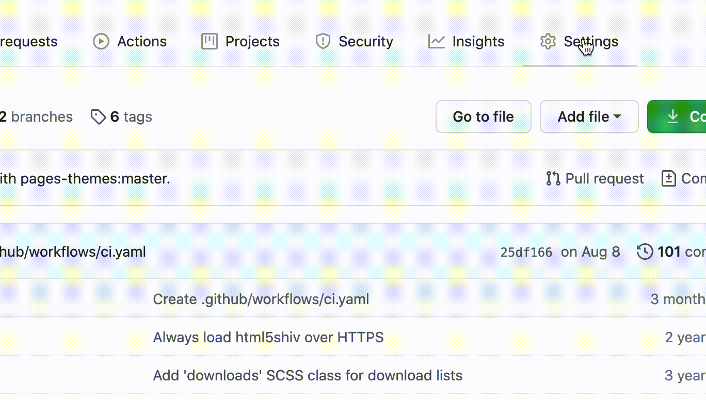
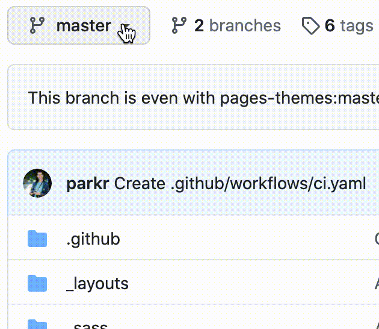
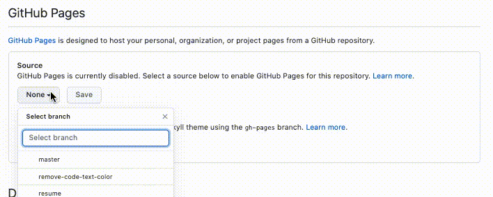
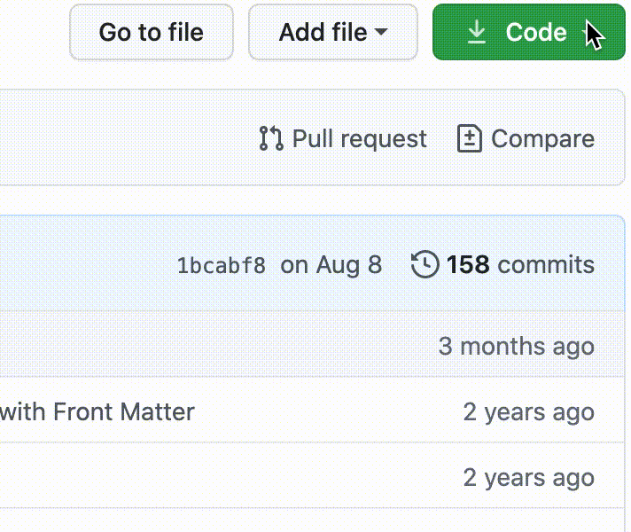
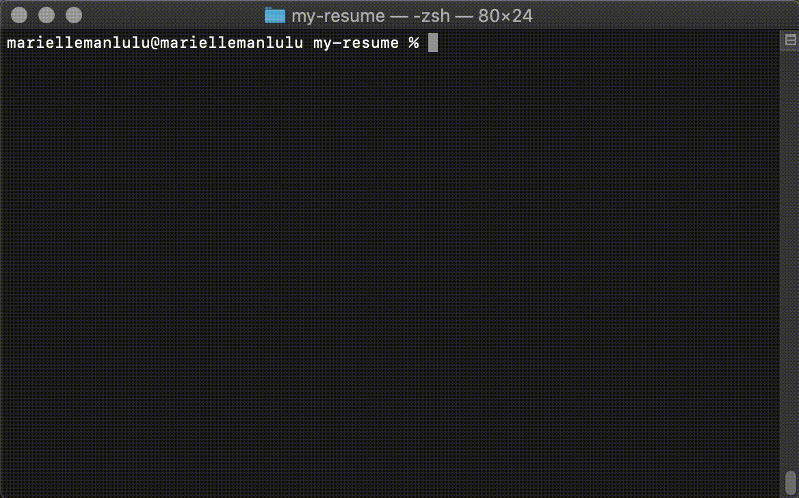

# Learn the Principles of Technical Documentation as You Build Your Own Static Resume Website

This document discusses about the principles of technical communication and demonstrate tools that are used for modern technical writing. Majority of the information references Andrew Etter's book, [Modern Technical Writing: An Introduction to Software Documentation](https://www.amazon.ca/Modern-Technical-Writing-Introduction-Documentation-ebook/dp/B01A2QL9SS). Here you can find a tutorial on how to host a static website resume that showcases the principles and tools of technical documentation. Follow along to see it in action!

## Table of Contents

- [Audience](#audience)
- [Build Your Own Static Resume Website](#build-your-own-static-resume-website)
  - [Prerequisites](#prerequisites)
  - [Instructions](#instructions)
  - [Principles of Technical Writing](#principles-of-technical-writing)
    - [Lightweight Markup Language](#lightweight-markup-language)
    - [Distributed Version Control](#distributed-version-control)
    - [Static Website Generator](#static-website-generator)
    - [Hosting the Site](#hosting-the-site)
- [More Resources](#more-resources)
- [Authors and Acknowledgments](#authors-and-acknowledgments)
- [FAQs](#faqs)

## Audience

This is for students interested in learning and applying the principles of modern technical writing mentioned in [Andrew Etter's book](https://www.amazon.ca/Modern-Technical-Writing-Introduction-Documentation-ebook/dp/B01A2QL9SS) by building a simple static resume website. No experience in Markdown or Github is assumed.

# Build Your Own Static Resume Website

Start by going through the [instructions](#instructions). Then, find out more about the [principles]() applied throughout. By the end, you should have a working online resume and acquire knowlegde about modern technical documentation key principles and tools.

## Prerequisites

- **Resume formatted in Markdown** - Here is a [tutorial](https://www.markdowntutorial.com/) to learn Markdown within minutes. [Dillinger](https://dillinger.io/) is a great online markdown editor.
- **Git Version Control** - [Install Git.](https://git-scm.com/book/en/v2/Getting-Started-Installing-Git) OSX and Linux system typically have this installed by default.
- **Jekyll** - [Install Jekyll](https://jekyllrb.com/docs/installation/), a static website generator that works with Github.
- **Github account** - A free account is acceptable. If you wish to make your website repository private, Github Pro is necessary. If you are a student, visit [GitHub Student Developer Pack](https://education.github.com/pack) to get one for free.

## Instructions

> Note: This set of steps forks a theme and lets you view and modify your site locally. Follow this [guide](https://guides.github.com/features/pages/) if you wish to make your site entirely remote.

**1. Choose a Jekyll theme.**

- Visit this [gallery](https://github.com/topics/jekyll-theme) for a list of Jekyll themes.
- For this project, I used [minimal](https://github.com/pages-themes/minimal).

**2. Fork the theme's repository.**

  

> Now that you have a separate copy of the repository, modify it to make it your own.

**3. Rename the repository.**

- Go to `Settings > Repository Name` to rename.

   

**4. Add a new branch.**

   

- Go to `Settings > Branches` to make the new branch the default branch

**5. Host your new site with Github Pages.**

- Go to `Settings > Github Pages`.
- Choose the new branch as the source.
- Save.

   

> Your static site is now hosted on `[your-user-name].github.io/[repository-name]/`. It's now time to modify the site locally.

**6. View site locally.**

- With the command line, go to the directory where you want the repository to reside.
  - `cd /home/user/my_project`
- Clone the repository with the URL.

  - `git clone https://github.com/<username>/<repository-name>.git`
  - _Note: You can find the URL under **Code**._

    

- Go to the repository.
  - `cd <repository-name>`
- Switch to the new branch.
  - `git checkout <new-branch-name>`
- Run the local server.
  - `bundle exec jekyll serve`
- Visit local server address.

  - `http://127.0.0.1:4000`
  - _Note: it maybe different from you, see command line output for the address._

   

**7. Modify site locally.**

- Open the project with your IDE.
- Replace `index.md` contents with your markdown-formatted resume contents.
- Once saved, refresh local site to see changes.
- **Tips:**
  - You can change the formatting and styles with `HTML` and `CSS` in `_layouts/` and `_sass/`, respectively.
  - You can set global properties, e.g. title, in `_config.yml`.
    - _More about Jekyll configuration [here](https://jekyllrb.com/docs/configuration/)._
  - See [More Resources](#more-resources) for tutorials.

**8. Update site remotely.**

- Stage files that were modified.
  - `git add <file1> <file2>`
- Commit your changes.
  - `git commit -m "<your commit message>"`
- Push your changes.

  - `git push`
  - _More information about git commands [here](https://confluence.atlassian.com/bitbucketserver/basic-git-commands-776639767.html)._

   

## Principles of Technical Writing

### Why static webpages?

Documentation are simple. They don't need a ton of dependencies. They should be fast, portable and accessible to anyone. Static sites are exactly that. That is why they are great for documentation. They can be hosted almost anywhere. No extensive installation, databases nor large-scale software needed to make one.

### Why did we use the tools that we used?

#### Lightweight Markup Language

- Using a lightweight markup language is highly recommended for technical documentation. They are designed to make the transition from content to a desired markup language, like HTML, seamless. Because the content is separated from everything else, it makes the editing process much more efficient. Unlike HTML or XML, the syntax is straightforward, clean and human readable.

- `Markdown` is the most popular lightweight markup language, hence, it is future proof. You can learn it in minutes! However, it provides limited features. Therefore, different Markdown "flavours" exists to make up for the lack of features. [Github Flavoured Markdown (GFM)](gfm) is used to write this `README.md`

#### Distributed Version Control

- Distributed Version Control provides many benefits when creating a documentation. It keeps track of the development history. It allows others to contribute to the same file concurrently. It provides the ability to work offline.

- `Git` is the version control being used for this repository and `GitHub` is the service that we use to manage our repositories. One advantage of this is that the documentation (this `README.md`) is stored alongside with the content. Doing so encourages the documentation to stay up to date and developers are more likely to contribute.

#### Static Website Generator

- Static website generator is what makes the job easy. Provide it with content (lightweight markup file) and a theme (HTML & CSS), and _viola_ it formats into a working website. Maintaining your site becomes effortless making your document in sync with the world in no time.

- `Jekyll` is the generator that Github Pages provides to process static websites. There are 3 ways you can work with Jekyll: [by modifiying settings](https://guides.github.com/features/pages/), forking a theme, or [starting from scratch](https://www.chrisanthropic.com/blog/2016/creating-gem-based-themes-for-jekyll/). Forking a theme was done for this project.

#### Hosting the Site

- After developing your site, it's now time to make it alive. Having your website hosted on the internet where anyone with a link can visit avoids duplication. Etter defines this as [_single sourcing_](https://en.wikipedia.org/wiki/Single-source_publishing). Having only one copy of the documentation ensures accuracy, because you are maintaining from a "single source". Moreover, you will need a web hosting provider and, generally, it is not free.

- `Github Pages`, however, is free for hosting a static site with Jekyll!

### Key Points

- Avoid duplication, use **single-source publishing**.
- Keep **documentation with source code**.
- **Encourage contribution** by using accesible tools and version control.
- **Separate content and formatting** for easy maintenance.

## More Resources

- [Modern Technical Writing: An Introduction to Software Documentation by Andrew Etter](https://www.amazon.ca/Modern-Technical-Writing-Introduction-Documentation-ebook/dp/B01A2QL9SS)
- [Markdown Tutorial](https://www.markdowntutorial.com/)
- [Editors Best Picks for Markdown by Shopify](https://www.shopify.ca/partners/blog/10-of-the-best-markdown-editors)
- [Flavoured Markdown Cheatsheet](https://enterprise.github.com/downloads/en/markdown-cheatsheet.pdf)
- [Jekyll Documentation](https://jekyllrb.com/docs/)
- [Jekyll Tutorial by Mike Dane](https://www.mikedane.com/static-site-generators/jekyll/)

## Authors and Acknowledgments

- **Author:** Marielle Manlulu ([@mariellemanlulu](https://github.com/mariellemanlulu))
- **Group Members for Peer Editing:**
  - Chris Ciceron ([@chrisciceron](https://github.com/chrisciceron))
  - Prakhar Sharma ([@neil3108](https://github.com/Neil3108))
- **Minimal Theme Author:** Ben Balter ([@benbalter](https://github.com/benbalter))

## FAQs

#### 1. Why is Markdown better than word processor for technical documentation?

- [shorten this] Unlike word processors, its contents are made with plain text and few syntaxes for formatting, which makes it compatible with the web. Furthermore, the formatting is done separately from the content, usually with HTML and CSS. This allows modification to be easy and simple. You can create Markdown documents anywhere with Markdown editors, while word can only be made using a specific software, e.g. .docx documents with Microsoft Word. Because it is plain text, it is superfast. Minimal processing behind the scene is required to produce a document. If you learn Markdown, or any lightweight processing language, you open up a lot of flexibility with formatting.

#### 2. Why is my Jekyll template with plugins not working?

- Some template uses plugins that are not supported by GitHub Pages. From [Jekyll's documentation](https://jekyllrb.com/docs/plugins/):

  > GitHub Pages is powered by Jekyll, however all Pages sites are generated using the --safe option to disable custom plugins for security reasons. Unfortunately, this means your plugins won’t work if you’re deploying to GitHub Pages.

- A workaround from the same documentation:
  > You can still use GitHub Pages to publish your site, but you’ll need to convert the site locally and push the generated static files to your GitHub repository instead of the Jekyll source files.
