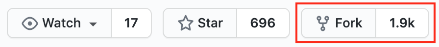
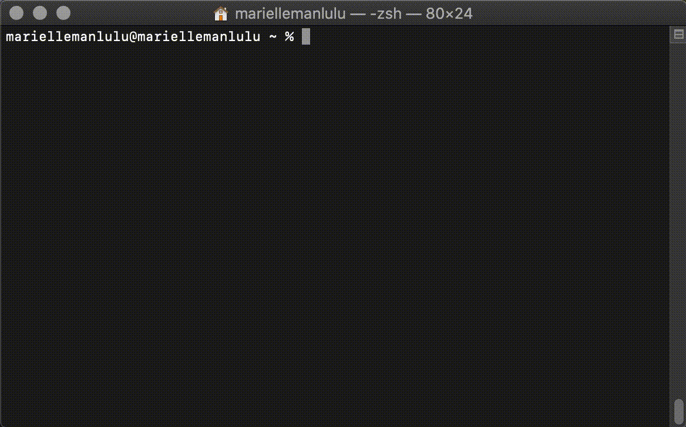

# Learn the Principles of Technical Documentation as You Build Your Own Static Resume Website

The following is a demo of a static website resume made with _Markdown_, _Github Pages_ and _Jekyll_:

This document references Andrew Etter's book, _[Modern Technical Writing: An Introduction to Software Documentation](https://www.amazon.ca/Modern-Technical-Writing-Introduction-Documentation-ebook/dp/B01A2QL9SS)_. Here you can find a tutorial on how to host a static website resume that showcases the principles and tools of technical documentation. Follow along to see it in action!

_**Who is it for?**_ -- This is written for students interested in _learning_ and _applying_ the principles of modern technical commmunicaion. No experience in Markdown or Github is assumed.

## Table of Contents

- [Getting Started](#getting-started)
  - [Prerequisites](#prerequisites)
  - [Instructions](#instructions)
  - [Principles of Technical Documentation](#principles-of-technical-documentation)
    - [Lightweight Markup Language](#lightweight-markup-language)
    - [Distributed Version Control](#distributed-version-control)
    - [Static Website Generator](#static-website-generator)
    - [Hosting the Site](#hosting-the-site)
- [More Resources](#more-resources)
- [Authors and Acknowledgments](#authors-and-acknowledgments)
- [FAQs](#faqs)

# Getting Started

Start by going through the [instructions](#instructions). Then, find out more about the [principles](#principles-of-technical-documentation) applied throughout. By the end, you should have a working online resume and have acquired knowlegde about modern technical documentation key principles and tools.

## Prerequisites

- **Resume formatted in Markdown** - Here is a [tutorial](https://www.markdowntutorial.com/) to learn Markdown within minutes. [Dillinger](https://dillinger.io/) is a great online markdown editor.
- **Git Version Control** - [Install Git.](https://git-scm.com/book/en/v2/Getting-Started-Installing-Git) OSX and Linux system typically have this installed by default.
- **Jekyll** - [Install Jekyll](https://jekyllrb.com/docs/installation/), a static website generator that works with Github.
- **Github account** - A free account is acceptable. If you wish to make your website repository private, Github Pro is necessary. If you are a student, visit [GitHub Student Developer Pack](https://education.github.com/pack) to get one for free.

## Instructions

> Note: The following is a set of steps that forks a theme and lets you view and modify your site locally. If you wish to make your site entirely remote, follow [this guide](https://guides.github.com/features/pages/) instead.

**1. Fork a theme repository.**

- Go to a Jekyll theme repository.

  - Visit this [gallery](https://github.com/topics/jekyll-theme) for a list of Jekyll themes.

- Click the button shown bellow:

  

**2. Modify the project to make it your own.**

- Go to `Settings > Repository Name` to rename the project.

- Create a new branch.

  _See animated GIF on how to do it._

   

- Go to `Settings > Branches` to make the new branch the default branch.

**3. Host your new site with Github Pages.**

- Go to `Settings > Github Pages`.
- Make the new branch as the source branch.
- Save.

> Your static site is now hosted on `[your-user-name].github.io/[repository-name]/`. It's now time to modify the site locally!

**4. View site locally.**

- With the command line, go to the directory where you want the repository to reside. For example:
  - `cd /home/user/my_project`
- Clone the repository.

  - `git clone https://github.com/<username>/<repository-name>.git`
  - _See animated GIF on how find the URL._

    

- Go to the repository.
  - `cd <repository-name>`
- Switch to the new branch.
  - `git checkout <new-branch-name>`
- Run the local server.
  - `bundle exec jekyll serve`
- Visit `localhost:4000` in your browser to preview the theme.

  _Refer to the animated GIF below to see the command line instructions visually._

   

**5. Modify site locally.**

- Open the project with your IDE.
- Replace `index.md` contents with your markdown-formatted resume contents.
- Once saved, refresh local site to see changes.
- **Tips:**
  - You can change the formatting and styles with `HTML` and `CSS` in `_layouts/` and `_sass/`, respectively.
  - You can set global properties, e.g. title, in `_config.yml`.
    - _More about Jekyll configuration [here](https://jekyllrb.com/docs/configuration/)._
  - See [More Resources](#more-resources) for tutorials.

**6. Update site remotely.**

- Stage files that were modified.
  - `git add <file1> <file2>`
- Commit your changes.
  - `git commit -m "<your commit message>"`
- Push your changes.

  - `git push`

  _Refer to the animated gif below to see command line instructions._

  

> If you have your static website opened, refresh the page to see your changes. _Note: You may have to wait for a few minutes._

## Principles of Technical Documentation

### Why static webpages?

Documentation should be simple, fast, portable and accessible to anyone. It shouldn't need a ton of dependencies. Static sites are exactly that. That is why they are great for documentation. They can be hosted almost anywhere. No extensive installation, databases nor large-scale software needed to make one.

### Why did we use the tools that we used?

#### Lightweight Markup Language

- Lightweight markup language are designed to make the transition from content to a desired markup language, like HTML, seamless. Because the content is separated from everything else, it makes the editing process much more efficient. Unlike HTML or XML, the syntax is straightforward, clean and human readable.

- `Markdown` is the most popular lightweight markup language, hence, it is future proof. You can learn it in minutes! However, it provides limited features. Therefore, different Markdown "flavours" exists to make up for the lack of features. [Github Flavoured Markdown (GFM)](https://github.com/adam-p/markdown-here/wiki/Markdown-Cheatsheet) is used to write this `README.md`

#### Distributed Version Control

- Distributed version control provides many benefits when creating a documentation. It keeps track of the development history and allows others to contribute to the same file concurrently. It also provides the ability to work offline.

- `Git` is the version control being used for this repository and `GitHub` is the service that we use to manage our repositories. One advantage of this is that the documentation (this `README.md`) is stored alongside with the content. Doing so encourages the documentation to stay up to date and developers are more likely to contribute.

#### Static Website Generator

- Static website generator is what makes the job easy. Provide it with content (lightweight markup file) and a theme (HTML & CSS), and _voila_ it formats into a working website. Maintenance becomes effortless making your document in sync with the world in no time.

- `Jekyll` is the generator that Github Pages provides to process static websites. There are 3 ways you can work with Jekyll: [by modifiying settings](https://guides.github.com/features/pages/), forking a theme, or [starting from scratch](https://www.chrisanthropic.com/blog/2016/creating-gem-based-themes-for-jekyll/). Forking a theme was done for this project.

#### Hosting the Site

- Having your website hosted on the internet where anyone with a link can visit avoids duplication. Etter defines this as [_single sourcing_](https://en.wikipedia.org/wiki/Single-source_publishing). Having only one copy of the documentation ensures accuracy, because you are maintaining from a "single source". Moreover, you will need a web hosting provider and, generally, it is not free.

- `Github Pages`, however, is free for hosting a static site with Jekyll!

### Key Points

- Avoid duplication, use **single-source publishing**.
- Keep **documentation with source code**.
- **Encourage contribution** by using accesible tools and version control.
- **Separate content and formatting** for easy maintenance.

## More Resources

- [Modern Technical Writing: An Introduction to Software Documentation by Andrew Etter](https://www.amazon.ca/Modern-Technical-Writing-Introduction-Documentation-ebook/dp/B01A2QL9SS)
- [Markdown Tutorial](https://www.markdowntutorial.com/)
- [Editors Best Picks for Markdown by Shopify](https://www.shopify.ca/partners/blog/10-of-the-best-markdown-editors)
- [Flavoured Markdown Cheatsheet](https://enterprise.github.com/downloads/en/markdown-cheatsheet.pdf)
- [Jekyll Documentation](https://jekyllrb.com/docs/)
- [Jekyll Tutorial by Mike Dane](https://www.mikedane.com/static-site-generators/jekyll/)

## Authors and Acknowledgments

- **Author:** Marielle Manlulu ([@mariellemanlulu](https://github.com/mariellemanlulu))
- **Group Members:**
  - Chris Ciceron ([@chrisciceron](https://github.com/chrisciceron))
  - Prakhar Sharma ([@neil3108](https://github.com/Neil3108))
- **Minimal Theme Author:** Steve Smith ([@orderedlist](https://github.com/orderedlist))

## FAQs

#### 1. Why is Markdown better than word processor for technical documentation?

- Its contents are made with plain text which makes it _fast_ and _compatible with static websites_. As discussed [above](#why-static-webpages), static websites are great for documentation. Furthermore, it's contents and formatting are separate, which opens up a lot of flexibility when modifiying your documentation.

#### 2. Why is my Jekyll template with plugins not working?

- Some template uses plugins that are not supported by GitHub Pages. A workaround from [Jekyll documentation](https://jekyllrb.com/docs/plugins/) states:
  > You can still use GitHub Pages to publish your site, but you’ll need to convert the site locally and push the generated static files to your GitHub repository instead of the Jekyll source files.
